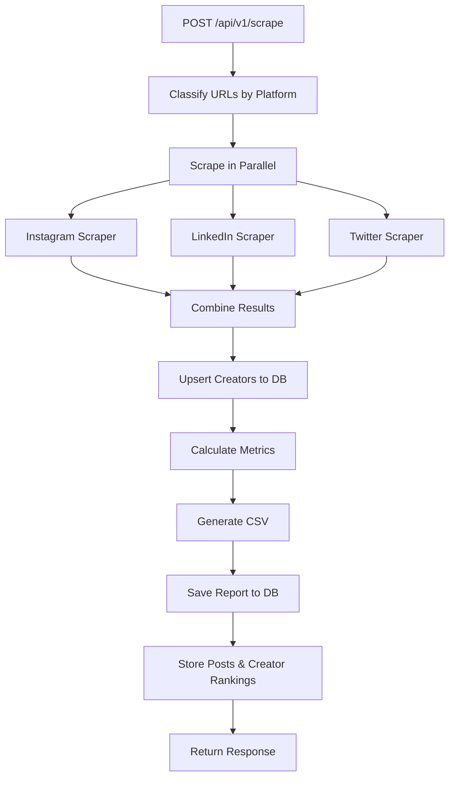

# Snoboard Backend - Social Media Scraper

FastAPI backend that scrapes social media posts (Instagram, LinkedIn, Twitter/X), generates CSV reports, and stores dashboard-ready analytics.

---

## 🔄 Complete Request Flow



### Step-by-Step Breakdown

| Step | File | What Happens |
|------|------|--------------|
| 1 | `main.py` | Receives POST request with `urls[]` and `campaign_name` |
| 2 | `url_classifier.py` | Classifies URLs into Instagram, LinkedIn, Twitter buckets |
| 3 | `scraper_orchestrator.py` | Runs platform scrapers in parallel using ThreadPoolExecutor |
| 4 | `apify/*.py` | Each scraper calls Apify API, parses response into `PostMetrics` and `CreatorData` |
| 5 | `creator.py` (repo) | **Upserts** creators to DB (no duplicates!) |
| 6 | `analytics.py` | Calculates totals, platform breakdown, creator rankings |
| 7 | `report_generator.py` | Generates CSV string with per-post data + aggregated summary |
| 8 | `report.py` (repo) | Saves report to `report` table |
| 9 | `report_post.py` (repo) | Saves each post to `report_post` table |
| 10 | `report_creator.py` (repo) | Saves ranked creators to `report_creator` table |

---

## 🔑 How Creator Upsert Works (No Duplicates!)

The magic is in `creator.py` repository:

```python
result = (
    self._client.table("creators")
    .upsert(data, on_conflict="profile_id")  # ← This is the key!
    .execute()
)
```

### What `on_conflict="profile_id"` does:

1. **First time** you scrape a creator:
   - Creator doesn't exist → INSERT new row
   
2. **Second time** you scrape the same creator:
   - `profile_id` already exists → UPDATE existing row (no duplicate!)

### Example:
```
First scrape of @Pmkphotoworks:
  → INSERT: id=uuid-123, profile_id="1252965117576306688", name="Parth"

Second scrape of @Pmkphotoworks:
  → UPDATE: id=uuid-123 (same row), name updated if changed
```

The `profile_id` is the **platform's unique user ID** (not our Supabase UUID):
- Twitter: `author.id` → `"1252965117576306688"`
- Instagram: `ownerId` → `"12345678"`
- LinkedIn: `author.profileId` → `"john-doe-abc123"`

---

## 📊 Database Schema

```
┌─────────────────┐     ┌─────────────────┐     ┌─────────────────┐
│    creators     │     │     report      │     │   report_post   │
├─────────────────┤     ├─────────────────┤     ├─────────────────┤
│ id (UUID, PK)   │     │ id (UUID, PK)   │     │ id (UUID, PK)   │
│ profile_id (UQ) │←────│ campaign_name   │←────│ report_id (FK)  │
│ name            │     │ file_name       │     │ url             │
│ platform        │     │ csv_content     │     │ platform        │
│ social_media_   │     │ total_posts     │     │ creator_handle  │
│   handle        │     │ total_likes     │     │ views           │
│ profile_url     │     │ platform_       │     │ likes           │
│ followers_count │     │   breakdown     │     │ comments        │
└─────────────────┘     └─────────────────┘     │ shares          │
        ↑                                        └─────────────────┘
        │
        │           ┌─────────────────┐
        └───────────│ report_creator  │
                    ├─────────────────┤
                    │ id (UUID, PK)   │
                    │ report_id (FK)  │
                    │ creator_id (FK) │ ← This links to creators.id!
                    │ handle          │
                    │ total_likes     │
                    │ rank            │
                    └─────────────────┘
```

### Key Relationships:
- `report_creator.creator_id` → `creators.id` (Supabase UUID, not profile_id)
- `report_post.report_id` → `report.id`
- `report_creator.report_id` → `report.id`

---

## 📁 Project Structure

```
app/
├── main.py                    # FastAPI app & endpoints
├── config.py                  # Environment settings
├── database/
│   ├── client.py              # Supabase client
│   ├── models.py              # Dataclasses (PostMetrics, CreatorData, etc.)
│   └── repositories/
│       ├── creator.py         # Creator CRUD (with upsert)
│       ├── report.py          # Report CRUD
│       ├── report_post.py     # Report posts CRUD
│       └── report_creator.py  # Report creators CRUD
├── schemas/
│   ├── request.py             # Pydantic request models
│   └── response.py            # Pydantic response models
└── services/
    ├── analytics.py           # Metrics calculation & ranking
    ├── report_generator.py    # CSV generation
    ├── url_classifier.py      # URL → Platform mapping
    ├── scraper_orchestrator.py # Parallel scraping
    └── apify/
        ├── base.py            # Base scraper class
        ├── instagram.py       # Instagram scraper
        ├── linkedin.py        # LinkedIn scraper
        └── twitter.py         # Twitter scraper
```

---

## 🛠 API Endpoints

| Method | Endpoint | Description |
|--------|----------|-------------|
| POST | `/api/v1/scrape` | Scrape URLs, generate report |
| GET | `/api/v1/reports` | List all reports |
| GET | `/api/v1/reports/{id}/dashboard` | Dashboard data (top creators, metrics) |
| GET | `/api/v1/reports/{id}/creators` | All creators ranked by engagement |
| GET | `/api/v1/reports/{id}/posts` | All posts for a report |
| GET | `/api/v1/reports/{id}/csv` | Get CSV content |

---

## 🚀 How to Run

```bash
# Install dependencies
uv sync

# Run locally
uv run uvicorn app.main:app --reload --port 8000

# Access Swagger docs
open http://localhost:8000/docs
```

---

## ⚙️ Environment Variables

```env
APIFY_API_TOKEN=your_token
INSTAGRAM_ACTOR_ID=apify/instagram-post-scraper
LINKEDIN_ACTOR_ID=supreme_coder/linkedin-post
TWITTER_ACTOR_ID=kaitoeasyapi/twitter-x-data-tweet-scraper-pay-per-result-cheapest
SUPABASE_URL=https://xxx.supabase.co
SUPABASE_KEY=your_key
REPORTS_DIR=reports/files/

# Tickets uploads (Cloudinary) — backend only
CLOUDINARY_CLOUD_NAME=your_cloud_name
CLOUDINARY_API_KEY=your_api_key
CLOUDINARY_API_SECRET=your_api_secret
```

---

## 📈 Ranking Formula

Creators are ranked by **total engagement**:

```
engagement = likes + comments + shares
```

Top performing creators appear first in dashboard responses.

---

## 🔍 Platform-Specific Notes

| Platform | Views Available? | Notes |
|----------|------------------|-------|
| Instagram | ✅ Yes | `videoPlayCount` or `videoViewCount` |
| LinkedIn | ❌ No | Always `null` in responses |
| Twitter | ✅ Yes | `viewCount` from API |
